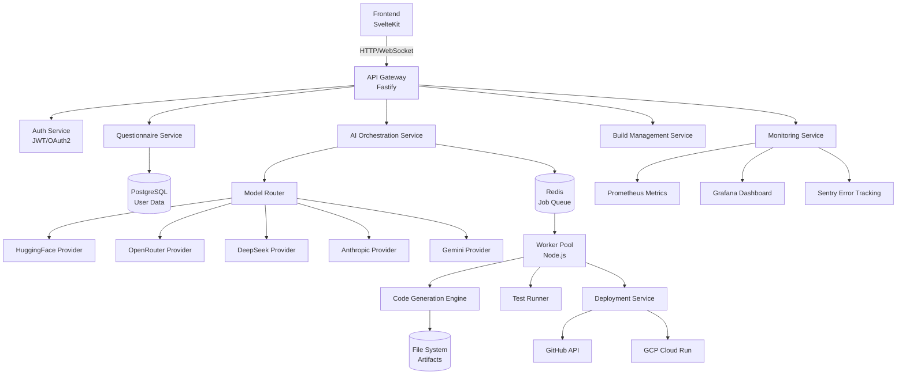

# AI App Builder

Transform your ideas into fully functional applications using artificial intelligence.

## 🚀 Quick Start

**Get running in 5 minutes:**

```bash
# 1. Install dependencies
pnpm install

# 2. Set up environment
copy server\.env.example server\.env
# Add: MODEL_ROUTER_DEMO_MODE=enabled

# 3. Start everything
pnpm run dev

# 4. Open browser
# http://localhost:5173
```

**📖 Detailed Guides:**
- **[QUICK_START.md](QUICK_START.md)** - 5-minute setup
- **[WHAT_YOU_NEED_TO_DO.md](WHAT_YOU_NEED_TO_DO.md)** - Your action items
- **[SETUP_GUIDE.md](SETUP_GUIDE.md)** - Complete setup guide
- **[TODO.md](TODO.md)** - What's left to do

---

## ✨ Features

### AI-Powered Code Generation
- **Multi-Model AI System**: OpenRouter, DeepSeek, HuggingFace, Anthropic
- **Intelligent Routing**: Automatic provider selection and fallback
- **Cost Optimization**: Smart model selection based on task complexity
- **Demo Mode**: Works without API keys for testing

### Automated Development
- **Task Planning**: AI breaks down specs into executable tasks
- **Code Generation**: Creates production-ready code
- **Self-Fixing**: Automatically debugs and fixes errors
- **Testing**: Runs tests and fixes failures

### Complete Platform
- **Questionnaire System**: Guided project specification
- **Real-Time Monitoring**: Live build progress updates
- **Deployment Automation**: One-click deploy to GCP/GitHub
- **Admin Dashboard**: Monitor costs, jobs, and system health

---

## 📋 Prerequisites

### Required
- **Node.js** 18+ ([Download](https://nodejs.org/))
- **pnpm** (`npm install -g pnpm`)

### Optional (For Full Functionality)
- **Redis** (job queue)
- **PostgreSQL** (production database)
- **Docker** (worker sandboxing)
- **API Keys** (for real AI - see [SETUP_GUIDE.md](SETUP_GUIDE.md))

---

## 🛠️ Installation

### Option 1: Demo Mode (No API Keys)

```bash
# 1. Install
pnpm install

# 2. Configure
copy server\.env.example server\.env
# Add: MODEL_ROUTER_DEMO_MODE=enabled

# 3. Start
pnpm run dev
```

### Option 2: With Real AI

```bash
# 1. Install
pnpm install

# 2. Get API key from:
# - OpenRouter: https://openrouter.ai/ (Recommended)
# - DeepSeek: https://platform.deepseek.com/
# - HuggingFace: https://huggingface.co/
# - Anthropic: https://console.anthropic.com/

# 3. Configure
copy server\.env.example server\.env
# Add your API key:
# OPENROUTER_API_KEY=sk-or-your-key-here
# MODEL_ROUTER_DEMO_MODE=auto

# 4. Start
pnpm run dev
```

---

## 📚 Documentation

### Getting Started
- **[QUICK_START.md](QUICK_START.md)** - Get running in 5 minutes
- **[WHAT_YOU_NEED_TO_DO.md](WHAT_YOU_NEED_TO_DO.md)** - Your action items
- **[SETUP_GUIDE.md](SETUP_GUIDE.md)** - Complete setup guide

### User Documentation
- **[User Guide](docs/user/README.md)** - How to use the platform
- **[Questionnaire Guide](docs/user/README.md#questionnaire-guide)** - Fill out specs
- **[Build Process](docs/user/README.md#understanding-the-build-process)** - How builds work

### Developer Documentation
- **[Developer Guide](docs/developer/README.md)** - Architecture and development
- **[API Reference](docs/api/README.md)** - Complete API documentation
- **[Integration Guide](docs/INTEGRATION_GUIDE.md)** - Quick integration

### Project Status
- **[TODO.md](TODO.md)** - What's left to do
- **[IMPLEMENTATION-COMPLETE.md](IMPLEMENTATION-COMPLETE.md)** - What's done

---

## 🏗️ Architecture

### 8-Stage Pipeline Architecture

```
┌─────────────────────────────────────────────────────────────────┐
│                     Frontend (SvelteKit)                         │
│                      Questionnaire UI                            │
└────────────────────────┬────────────────────────────────────────┘
                         │ specs.json
                         ↓
┌─────────────────────────────────────────────────────────────────┐
│              Pipeline Orchestrator (Stage-Based)                 │
│  ┌──────────────────────────────────────────────────────────┐  │
│  │ Stage 0: Questionnaire → specs.json (No AI)              │  │
│  └──────────────────────────────────────────────────────────┘  │
│  ┌──────────────────────────────────────────────────────────┐  │
│  │ Stage 1: HF Clarifier → specs_refined.json               │  │
│  └──────────────────────────────────────────────────────────┘  │
│  ┌──────────────────────────────────────────────────────────┐  │
│  │ Stage 1.5: GPT-5 Mini → specs_clean.json                 │  │
│  └──────────────────────────────────────────────────────────┘  │
│  ┌──────────────────────────────────────────────────────────┐  │
│  │ Stage 2: Llama 4 Scout → docs.md                         │  │
│  └──────────────────────────────────────────────────────────┘  │
│  ┌──────────────────────────────────────────────────────────┐  │
│  │ Stage 3: DeepSeek-V3 → schema.json                       │  │
│  └──────────────────────────────────────────────────────────┘  │
│  ┌──────────────────────────────────────────────────────────┐  │
│  │ Stage 3.5: GPT-5 Mini → structural_issues.json           │  │
│  └──────────────────────────────────────────────────────────┘  │
│  ┌──────────────────────────────────────────────────────────┐  │
│  │ Stage 4: GPT-4o → file_structure.json                    │  │
│  └──────────────────────────────────────────────────────────┘  │
│  ┌──────────────────────────────────────────────────────────┐  │
│  │ Stage 5: Claude 3.5 Haiku → validated_structure.json     │  │
│  └──────────────────────────────────────────────────────────┘  │
│  ┌──────────────────────────────────────────────────────────┐  │
│  │ Stage 6: Worker creates empty files                      │  │
│  └──────────────────────────────────────────────────────────┘  │
│  ┌──────────────────────────────────────────────────────────┐  │
│  │ Stage 7: GPT-5 Mini + Gemini-3 → code files              │  │
│  └──────────────────────────────────────────────────────────┘  │
│  ┌──────────────────────────────────────────────────────────┐  │
│  │ Stage 8: GitHub repo creation & push                     │  │
│  └──────────────────────────────────────────────────────────┘  │
└────────────────────┬────────────────────────────────────────────┘
                     │
                     ↓
┌─────────────────────────────────────────────────────────────────┐
│              Stage-Based Model Router                            │
│  - Direct stage-to-model mapping                                 │
│  - No agent role abstraction                                     │
│  - Provider health checking & fallback                           │
└────────────────────┬────────────────────────────────────────────┘
                     │
                     ↓
┌─────────────────────────────────────────────────────────────────┐
│                    LLM Providers                                 │
│  - HuggingFaceProvider (OpenHermes/Qwen)                        │
│  - ZukijourneyProvider (GPT-5 Mini, GPT-4o, Claude Haiku)      │
│  - GitHubModelsProvider (Llama 4 Scout)                         │
│  - DeepSeekProvider (DeepSeek-V3, DeepSeek-R1)                 │
│  - GeminiProvider (Gemini-3)                                    │
└─────────────────────────────────────────────────────────────────┘
```

**Key Components:**
- **Pipeline Orchestrator**: Manages deterministic 8-stage pipeline
- **Stage Router**: Routes stages to specific models (no agent roles)
- **Prompt Templates**: Canonical prompts for each stage
- **Artifact Storage**: Structured storage (/specs, /docs, /code)
- **Build Model**: Tracks stage progress and artifacts

---

## 🎯 What's Implemented

### ✅ Complete
- AI Integration (ModelRouter, providers, fallback)
- Task Planning with LLM
- Code Generation (templates + AI)
- Self-Fix Loop (automated debugging)
- Job Queue and Workers
- Authentication and Security
- Database Models
- Deployment Automation
- Monitoring and Logging
- Admin Dashboard
- Complete Documentation

### ⚠️ Needs Integration
- Connect ModelRouter to services
- Wire components together
- Run comprehensive tests
- Set up production environment

**See [TODO.md](TODO.md) for details**

---

## 🧪 Testing

```bash
# Run all tests
pnpm test

# Run specific tests
cd server && pnpm test
cd Frontend && pnpm test
cd workers && pnpm test

# Run with coverage
pnpm test:coverage
```

---

## 🚀 Deployment

### Development
```bash
pnpm run dev
```

### Production
```bash
# Build
pnpm run build

# Start
pnpm run start
```

**See [SETUP_GUIDE.md](SETUP_GUIDE.md) for production setup**

---

## 📊 System Status

| Component | Status | Notes |
|-----------|--------|-------|
| Frontend | ✅ Complete | SvelteKit, Tailwind |
| Backend | ✅ Complete | Fastify, JWT auth |
| AI Integration | ✅ Complete | Multi-provider support |
| Code Generation | ✅ Complete | Templates + LLM |
| Self-Fix Loop | ✅ Complete | Auto-debugging |
| Job Queue | ✅ Complete | BullMQ + Redis |
| Workers | ✅ Complete | Job execution |
| Deployment | ✅ Complete | GCP + GitHub |
| Monitoring | ✅ Complete | Metrics + logs |
| Documentation | ✅ Complete | 4,000+ lines |
| Integration | ⚠️ In Progress | Wiring components |
| Testing | ⚠️ In Progress | Comprehensive tests |

---

## 🤝 Contributing

1. Read [Developer Guide](docs/developer/README.md)
2. Check [TODO.md](TODO.md) for tasks
3. Follow code style guidelines
4. Write tests for new features
5. Update documentation

---

## 📝 License

Copyright © 2024 AI App Builder. All rights reserved.

---

## 🆘 Support

- **Setup Issues**: [SETUP_GUIDE.md](SETUP_GUIDE.md)
- **Quick Questions**: [QUICK_START.md](QUICK_START.md)
- **API Questions**: [docs/api/README.md](docs/api/README.md)
- **GitHub Issues**: [Create Issue](https://github.com/your-org/ai-app-builder/issues)

---

## 🎉 Get Started Now!

```bash
pnpm install
copy server\.env.example server\.env
# Add: MODEL_ROUTER_DEMO_MODE=enabled
pnpm run dev
# Open: http://localhost:5173
```

**That's it! Start building with AI! 🚀**

```bash
# Environment files are created automatically from examples
# server/.env - Backend configuration
# Frontend/.env - Frontend configuration  
# workers/.env - Workers configuration

# Optional: Configure AI service API keys for real AI responses
# Edit server/.env and add:
# OPENAI_API_KEY=your_key_here
# ANTHROPIC_API_KEY=your_key_here
# Note: Mock AI responses are used by default if no keys provided
```

### 3. Development Setup

```bash
# Start all services for demo (recommended)
pnpm run demo

# Or start services individually:
pnpm run dev  # Starts all services in parallel

# Or start each service separately:
cd server && pnpm run dev     # Backend API (port 3000)
cd Frontend && pnpm run dev   # Frontend (port 5173)  
cd workers && pnpm run dev    # Workers (port 3001)
```

### 4. Access the Application

- **Frontend**: http://localhost:5173
- **Backend API**: http://localhost:3000  
- **Workers Service**: http://localhost:3001
- **Enhanced Questionnaire**: http://localhost:5173/questionnaire

### 5. Quick Demo

1. Open http://localhost:5173/questionnaire
2. Select your experience level (Developer or Non-Developer)
3. Fill out the project questionnaire
4. Experience AI-powered guidance and recommendations
5. Generate your application specification

## 🏗️ Architecture Overview

```
┌─────────────────┐    ┌─────────────────┐    ┌─────────────────┐
│   Frontend      │    │   Backend       │    │   Workers       │
│   (Svelte 5)    │◄──►│   (Fastify)     │◄──►│   (Node.js)     │
│                 │    │                 │    │                 │
│ • Questionnaire │    │ • AI Services   │    │ • Job Queue     │
│ • User Interface│    │ • API Routes    │    │ • Build Tasks   │
│ • State Mgmt    │    │ • Config Mgmt   │    │ • Monitoring    │
└─────────────────┘    └─────────────────┘    └─────────────────┘
```

### Key Components

#### Frontend (`Frontend/`)
- **Questionnaire System**: Enhanced multi-stage questionnaire with AI guidance
- **Component Library**: Reusable UI components for different user modes
- **State Management**: Svelte stores with persistence and migration
- **Configuration Service**: Feature flag and settings management

#### Backend (`server/`)
- **AI Services**: Guidance engine, technical inference, spec processing
- **API Routes**: RESTful endpoints for questionnaire and AI operations
- **Configuration Management**: Environment-specific settings and feature flags
- **Audit & Logging**: Comprehensive activity tracking with GDPR compliance

#### Workers (`workers/`)
- **Job Processing**: Background task execution for builds and deployments
- **Queue Management**: Redis-based job queue with monitoring
- **Build Pipeline**: Automated application generation and deployment

## 📖 Usage Guide

### For Non-Developers

1. **Start the Questionnaire**: Navigate to `/questionnaire`
2. **Select Non-Developer Mode**: Choose your experience level
3. **Describe Your Project**: Provide project details and goals
4. **Get AI Guidance**: Receive intelligent suggestions and clarifications
5. **Review Generated Spec**: AI will infer technical requirements
6. **Build Your App**: Automated generation based on your requirements

### For Developers

1. **Start the Questionnaire**: Navigate to `/questionnaire`
2. **Select Developer Mode**: Access technical configuration options
3. **Configure Technical Stack**: Choose frameworks, databases, and tools
4. **Define Architecture**: Specify patterns and deployment preferences
5. **Get Expert Guidance**: Receive advanced technical recommendations
6. **Generate Application**: Create production-ready code structure

## 🔧 Configuration

### Feature Flags

Control which enhanced features are available:

```javascript
// server/config/enhanced-questionnaire.js
featureFlags: {
  enhancedProcessing: true,      // Enhanced questionnaire processing
  aiGuidance: true,              // AI guidance generation
  technicalInference: true,      // Technical stack inference
  contextualHelp: true,          // Smart help and suggestions
  enhancedValidation: true       // Advanced validation
}
```

### Environment Settings

#### Development
```bash
# Enable all features for development
ENHANCED_QUESTIONNAIRE_ENABLED=true
AI_GUIDANCE_ENABLED=true
TECHNICAL_INFERENCE_ENABLED=true
MOCK_AI_RESPONSES=false
```

#### Production
```bash
# Controlled rollout in production
ENHANCED_QUESTIONNAIRE_ENABLED=true
AI_GUIDANCE_ENABLED=false
TECHNICAL_INFERENCE_ENABLED=false
RATE_LIMITING_ENABLED=true
```

## 🧪 Testing

### Run All Tests
```bash
pnpm test
```

### Component Tests
```bash
# Frontend tests
cd Frontend && pnpm test

# Backend tests
cd server && pnpm test

# Worker tests
cd workers && pnpm test
```

### Integration Tests
```bash
# Run integration test suite
cd server && pnpm test:integration
```

## 📊 Monitoring & Observability

### Health Checks
- **Frontend**: http://localhost:5173/health
- **Backend**: http://localhost:3000/health
- **Workers**: http://localhost:3001/health

### Metrics & Logging
- Structured logging with correlation IDs
- Performance metrics collection
- Error tracking and alerting
- User activity audit trails

## 🔒 Security & Privacy

### Data Protection
- GDPR-compliant data handling
- PII sanitization in logs
- Configurable data retention periods
- User consent management

### Security Features
- Input sanitization and validation
- Rate limiting and DDoS protection
- Secure API authentication
- Environment-based security controls

## 🚀 Deployment

### Development Deployment
```bash
# Start all services
docker-compose up -d

# Or use the development script
./scripts/dev-setup.sh
```

### Production Deployment
```bash
# Build production images
docker-compose -f docker-compose.prod.yml build

# Deploy to production
docker-compose -f docker-compose.prod.yml up -d
```

### Infrastructure as Code
```bash
# Deploy with Terraform
cd infra/terraform
terraform init
terraform plan
terraform apply
```

### GCP Deployment Architecture

#### Service Integration
- **Cloud Run**: Containerized application deployment with automatic scaling
- **Cloud Functions**: Serverless functions for event-driven processing  
- **Cloud Storage**: Artifact storage for build outputs and specifications
- **Cloud SQL**: Managed PostgreSQL database for production workloads
- **Cloud Memorystore**: Redis-compatible cache for job queues
- **Cloud Build**: CI/CD pipeline integration for automated deployments

#### Scalability Planning
- **Horizontal Scaling**: Auto-scaling based on CPU/memory utilization and request rate
- **Concurrency Limits**: Configurable concurrent build limits per project
- **Resource Quotas**: GCP quota management for cost control
- **Load Balancing**: Global load balancing for multi-region deployments
- **Cold Start Optimization**: Pre-warmed instances for critical paths

#### Operational Considerations
- **Monitoring**: Cloud Monitoring and Cloud Logging integration
- **Alerting**: Custom metrics and alerting policies for build failures
- **Cost Optimization**: Spot instances for non-critical workloads
- **Security**: IAM roles, VPC Service Controls, and private networking
- **Backup & Recovery**: Automated backups with point-in-time recovery

## 📚 API Documentation

### Enhanced Questionnaire Endpoints

#### Get Configuration
```http
GET /api/questionnaire/config
```

#### Process Questionnaire
```http
POST /api/questionnaire/process
Content-Type: application/json

{
  "questionnaireData": { ... },
  "userMode": "developer|non-developer",
  "options": { ... }
}
```

#### Generate AI Guidance
```http
POST /api/questionnaire/guidance
Content-Type: application/json

{
  "questionnaireData": { ... },
  "userMode": "developer|non-developer",
  "guidanceType": "comprehensive"
}
```

#### Technical Inference
```http
POST /api/questionnaire/infer-tech
Content-Type: application/json

{
  "projectData": { ... },
  "options": {
    "includeAlternatives": true,
    "includeReasoning": true
  }
}
```

## 🤝 Contributing

1. Fork the repository
2. Create a feature branch: `git checkout -b feature/amazing-feature`
3. Commit your changes: `git commit -m 'Add amazing feature'`
4. Push to the branch: `git push origin feature/amazing-feature`
5. Open a Pull Request

### Development Guidelines
- Follow the existing code style and patterns
- Add tests for new features
- Update documentation for API changes
- Ensure backward compatibility

## 📄 License

This project is licensed under the MIT License - see the [LICENSE](LICENSE) file for details.

## 🆘 Support

### Documentation
- [Detailed Explanation](EXPLANATION.md) - Comprehensive system overview
- [API Reference](docs/api.md) - Complete API documentation
- [Deployment Guide](infra/DEPLOYMENT_GUIDE.md) - Production deployment instructions

### Getting Help
- Create an issue for bug reports
- Use discussions for questions and feature requests
- Check existing documentation before asking questions

## 🎯 Roadmap

### Upcoming Features
- [ ] Multi-language support
- [ ] Advanced AI model integration
- [ ] Real-time collaboration
- [ ] Enhanced deployment options
- [ ] Mobile application support

### Recent Updates
- ✅ Enhanced questionnaire integration
- ✅ AI-powered guidance system
- ✅ Feature flag management
- ✅ Backward compatibility support
- ✅ Comprehensive audit logging

---

## 🏗️ Senior-Level Architectural Deep Dive

### System Architecture Diagram



### AI Fault Tolerance Deep Dive

**Exactly-Once vs At-Least-Once Delivery Semantics:**
- **At-Least-Once**: Default behavior for AI generations to ensure no data loss
- **Exactly-Once**: Implemented via idempotency keys for critical operations (deployment, billing)
- **Idempotency Key Generation**: UUIDv4 with timestamp prefix for temporal ordering
- **Validation**: Redis-based idempotency store with TTL matching business logic

**Replay Mechanism Implementation:**
- **Build Artifacts**: All intermediate artifacts stored with versioned paths
- **Stage Replay**: Individual pipeline stages can be replayed independently
- **Full Pipeline Replay**: Complete rebuild capability with consistent outputs
- **Cost Optimization**: Cache-aware replay that skips unchanged stages

**LLM Provider Failure Handling:**
- **Health Checks**: Active monitoring of provider availability and response times
- **Automatic Fallback**: Seamless transition to backup providers on failure
- **Cost-Aware Routing**: Preference hierarchy based on cost/performance ratio
- **Circuit Breaker**: Temporary disablement of failing providers

### Security Architecture

**Threat Model:**
1. **Malicious Prompt Injection**: Sanitized inputs and structured prompt templates
2. **AI Provider Compromise**: Isolated worker processes with minimal privileges
3. **Generated Code Exploitation**: Static analysis and sandboxed execution
4. **Data Exfiltration**: Network egress filtering and artifact scanning
5. **Billing Abuse**: Per-user quotas and anomaly detection

**Cryptographic Implementation:**
- **End-to-End Encryption**: User data encrypted at rest with AES-256-GCM
- **Key Management**: HashiCorp Vault integration for secret management
- **Signature Verification**: HMAC-SHA256 for webhook payload verification
- **Certificate Pinning**: Strict TLS validation for all external communications

**Rate Limiting and Circuit Breakers:**
- **Token Bucket Algorithm**: Per-user and global rate limiting
- **Adaptive Throttling**: Dynamic limits based on system load
- **Provider Circuit Breakers**: Automatic disablement of unhealthy AI providers
- **Emergency Shutdown**: Graceful degradation during system overload

### Operational Excellence

**Monitoring Dashboard Specifications:**
- **Real-time Metrics**: Build queue length, AI provider latency, success rates
- **Cost Tracking**: Per-user and per-project AI consumption metrics
- **Quality Indicators**: Code generation success rate, test pass rate, deployment success
- **User Analytics**: Feature usage patterns and conversion funnels

**Alerting Thresholds and Runbooks:**
- **Critical Alerts**: >95% queue utilization, >5min provider latency, <90% success rate
- **Warning Alerts**: >80% queue utilization, >2min provider latency, <95% success rate
- **Automated Remediation**: Auto-scaling, provider failover, resource cleanup
- **Incident Response**: Escalation procedures and post-mortem templates

**Backup and Restore Procedures:**
- **Point-in-Time Recovery**: PostgreSQL WAL archiving with 15-minute RPO
- **Artifact Versioning**: Immutable build artifacts with cryptographic hashes
- **Disaster Recovery**: Multi-region deployment with automated failover
- **Data Retention**: Configurable retention policies with GDPR compliance

**Capacity Planning Guidelines:**
- **Concurrent Builds**: 100 concurrent builds per 4-core, 16GB RAM instance
- **AI Provider Quotas**: Conservative rate limiting to prevent throttling
- **Storage Requirements**: 1GB per active user per month (artifacts + logs)
- **Network Bandwidth**: 10MB/s per concurrent build for artifact transfer

### Scaling Patterns

**Horizontal Scaling Strategies:**
- **Stateless Services**: API gateway and orchestration services scale horizontally
- **Worker Pool Scaling**: Dynamic worker count based on queue depth
- **Database Read Replicas**: Separate read replicas for analytics queries
- **Cache Layer**: Redis cluster for session and idempotency storage

**Sharding Strategy:**
- **User-Based Sharding**: Users assigned to specific worker pools
- **Project-Based Sharding**: Large projects get dedicated resources
- **Provider-Based Routing**: AI requests routed to optimal provider regions
- **Geographic Distribution**: Edge caching for global user base

**Queue Backpressure Handling:**
- **Priority Queues**: Critical operations (deployments) get higher priority
- **Fair Scheduling**: Prevent single user from monopolizing resources
- **Graceful Degradation**: Reduce non-critical features under load
- **Resource Quotas**: Hard limits on CPU, memory, and network per build

**Performance Benchmarks:**
- **Cold Start**: 15-30 seconds for complete pipeline initialization
- **Warm Build**: 2-5 minutes for typical application generation
- **AI Latency**: 30-120 seconds per LLM call depending on provider
- **Throughput**: 50 concurrent builds per standard deployment

### Integration Patterns

**Message Queue Integration:**
- **BullMQ**: Primary job queue with Redis backend
- **Kafka Alternative**: Event streaming for high-volume deployments
- **SQS Compatibility**: AWS integration for cloud-native deployments
- **Dead Letter Queues**: Failed job isolation and retry mechanisms

**Batch Delivery Patterns:**
- **Webhook Batching**: Multiple events delivered in single HTTP request
- **Async Processing**: Long-running operations return immediately with status endpoint
- **Progress Updates**: WebSocket streams for real-time build progress
- **Result Aggregation**: Combined results from multiple AI providers

**Webhook Signature Verification:**
```javascript
const crypto = require('crypto');

function verifyWebhookSignature(payload, signature, secret) {
  const expectedSignature = crypto
    .createHmac('sha256', secret)
    .update(payload)
    .digest('hex');
  return crypto.timingSafeEqual(
    Buffer.from(signature),
    Buffer.from(`sha256=${expectedSignature}`)
  );
}
```

**Replay API Usage:**
```bash
# Replay specific build stage
POST /api/v1/builds/{buildId}/replay
{
  "stage": "code-generation",
  "force": true,
  "preserveArtifacts": true
}

# Replay entire pipeline
POST /api/v1/builds/{buildId}/replay
{
  "stage": "all",
  "incremental": false
}
```

**AI Provider Integration Example:**
```javascript
// Multi-provider fallback pattern
async function generateCode(specs, options = {}) {
  const providers = [
    { name: 'openrouter', priority: 1, cost: 'low' },
    { name: 'deepseek', priority: 2, cost: 'medium' },
    { name: 'anthropic', priority: 3, cost: 'high' }
  ];
  
  for (const provider of providers) {
    try {
      const result = await aiProviders[provider.name].generate(specs, options);
      if (result.success) {
        return { ...result, provider: provider.name };
      }
    } catch (error) {
      logger.warn(`Provider ${provider.name} failed:`, error.message);
      continue;
    }
  }
  
  throw new Error('All AI providers failed');
}
```

---